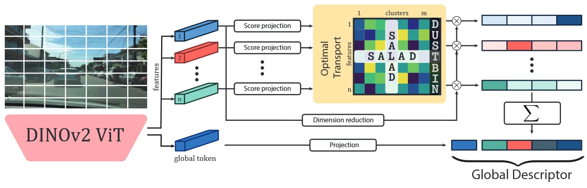

# Optimal Transport Aggregation for Visual Place Recognition
Sergio Izquierdo, Javier Civera

Code and models for Optimal Transport Aggregation for Visual Place Recognition (DINOv2 SALAD).

## Summary

We introduce DINOv2 SALAD, a Visual Place Recognition model that achieves state-of-the-art results on common benchmarks. We introduce two main contributions:
 - Using a finetuned DINOv2 encoder to get richer and more powerful features.
 - A new aggregation technique based on optimal transport to create a global descriptor based on optimal transport. This aggregation extends NetVLAD to consider feature-to-cluster relations as well as cluster-to-features. Besides, it includes a dustbin to discard uninformative features.

For more details, check the paper at [arXiv](https://arxiv.org/abs/2311.15937).



## Setup

It has been tested on Pytorch 2.1.0 with CUDA 12.1 and Xformers. Create a ready to run environment with:
```bash
conda env create -f environment.yml
```

To quickly test and use our model, you can use Torch Hub:
```python
import torch
model = torch.hub.load("serizba/salad", "dinov2_salad")
model.eval()
model.cuda()
```

## Dataset

For training, download [GSV-Cities](https://github.com/amaralibey/gsv-cities) dataset. For evaluation download the desired datasets ([MSLS](https://github.com/FrederikWarburg/mapillary_sls), [NordLand](https://surfdrive.surf.nl/files/index.php/s/sbZRXzYe3l0v67W), [SPED](https://surfdrive.surf.nl/files/index.php/s/sbZRXzYe3l0v67W), or [Pittsburgh](https://data.ciirc.cvut.cz/public/projects/2015netVLAD/Pittsburgh250k/))

## Train

Training is done on GSV-Cities for 4 complete epochs. It requires around 30 minutes on an NVIDIA RTX 3090. For training DINOv2 SALAD run:
```bash
python3 main.py
```

After training, logs and checkpoints should be on the `logs` dir.

## Evaluation

You can download a pretrained DINOv2 SALAD model from [here](https://drive.google.com/file/d/1u83Dmqmm1-uikOPr58IIhfIzDYwFxCy1/view?usp=sharing). For evaluating run:

```bash
python3 eval.py --ckpt_path 'weights/dino_salad.ckpt' --image_size 322 322 --batch_size 256 --val_datasets MSLS Nordland
```

<table>
<thead>
  <tr>
    <th colspan="3">MSLS Challenge</th>
    <th colspan="3">MSLS Val</th>
    <th colspan="3">NordLand</th>
  </tr>
  <tr>
    <th>R@1</th>
    <th>R@5</th>
    <th>R@10</th>
    <th>R@1</th>
    <th>R@5</th>
    <th>R@10</th>
    <th>R@1</th>
    <th>R@5</th>
    <th>R@10</th>
  </tr>
</thead>
<tbody>
  <tr>
    <td>75.0</td>
    <td>88.8</td>
    <td>91.3</td>
    <td>92.2</td>
    <td>96.4</td>
    <td>97.0</td>
    <td>76.0</td>
    <td>89.2</td>
    <td>92.0</td>
  </tr>
</tbody>
</table>

## Acknowledgements
This code is based on the amazing work of:
 - [MixVPR](https://github.com/amaralibey/MixVPR)
 - [GSV-Cities](https://github.com/amaralibey/gsv-cities)
 - [DINOv2](https://github.com/facebookresearch/dinov2)

## Cite
Here is the bibtex to cite our paper
```
@InProceedings{Izquierdo_CVPR_2024_SALAD,
    author    = {Izquierdo, Sergio and Civera, Javier},
    title     = {Optimal Transport Aggregation for Visual Place Recognition},
    booktitle = {Proceedings of the IEEE/CVF Conference on Computer Vision and Pattern Recognition (CVPR)},
    month     = {June},
    year      = {2024},
}
```
